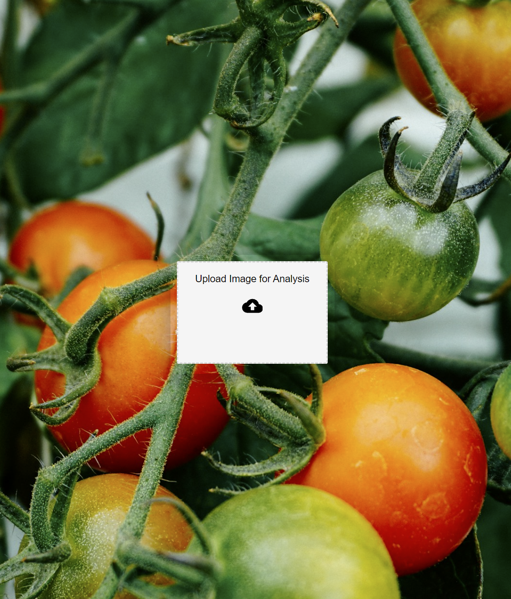
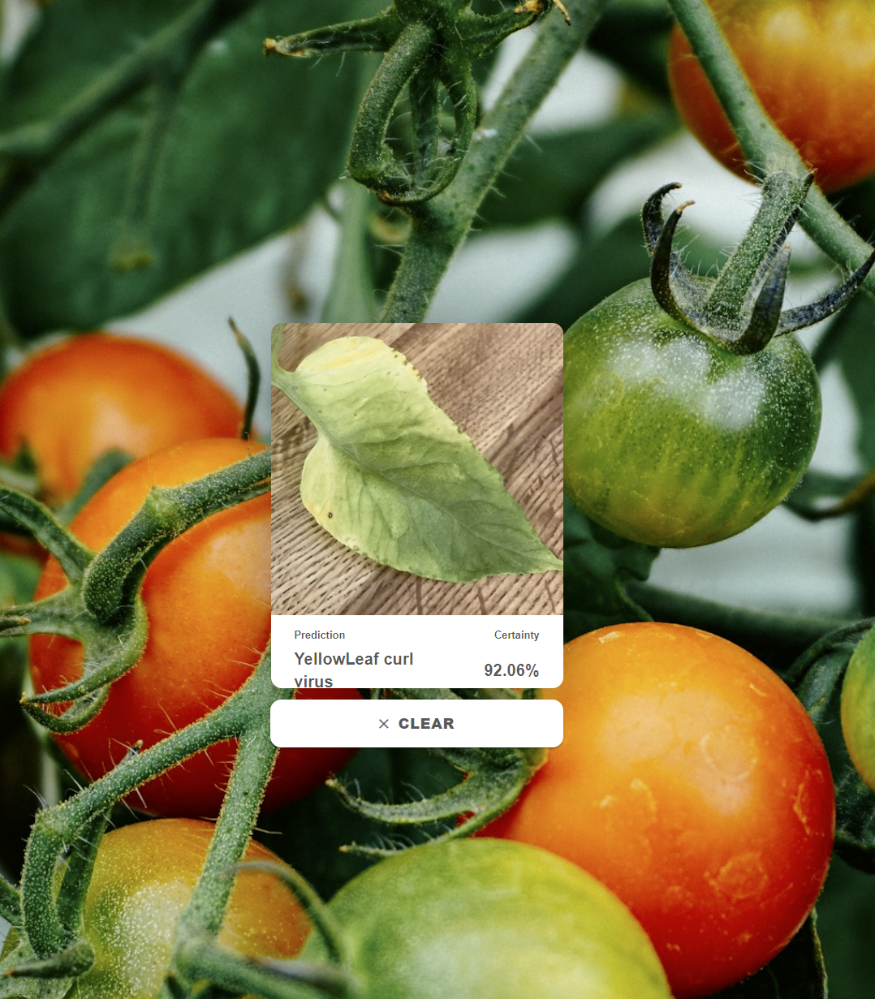

# TomatoGuard: Intelligent Plant Health Monitor

The Tomato Plant Health Detector is designed to revolutionize crop management for farmers. With the ability to analyze images of tomato plant leaves uploaded to an intuitive website, this tool leverages machine learning to detect common issues like **Bacterial spot, Mosaic virus** and many more. By providing quick and accurate diagnoses, it empowers farmers to take proactive measures in maintaining crop health.
## Structure

- [Frontend](https://github.com/PrxncE-LixH/Tomato_Leaf_Analysis/tree/master/frontend)
- [Backend](https://github.com/PrxncE-LixH/Tomato_Leaf_Analysis/blob/master/backend.py)
- [Model](https://github.com/PrxncE-LixH/Tomato_Leaf_Analysis/blob/master/main.ipynb)
- [Saved model](https://github.com/PrxncE-LixH/Tomato_Leaf_Analysis/tree/master/saved_models)

## License


[](https://choosealicense.com/licenses/mit/)

## Authors

- [PrxncE-LixH](https://github.com/PrxncE-LixH)


## Installation
- Frontend

- Install Node Packages - cd Frontend directory
```
npm -i
```

- Make these changes to the package.json file
```
"start": "react-scripts --openssl-legacy-provider start",
"build": "react-scripts --openssl-legacy-provider build",
```

- create a .env file in the root directory of the Frontend that has the API endpoint
```
REACT_APP_API_URL="http://localhost:8000/predict"
```
- Start frontend website
```
npm run start
```

- Backend

- Install dependancies - Main directory
```
pip install -r requirements.txt
```

- Start server
```
uvicorn backend:app --reload
```
    
## Dataset
```
https://www.kaggle.com/datasets/abdallahalidev/plantvillage-dataset

```
## Screenshots



